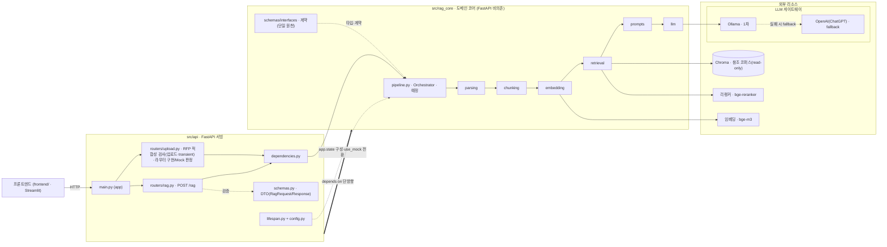
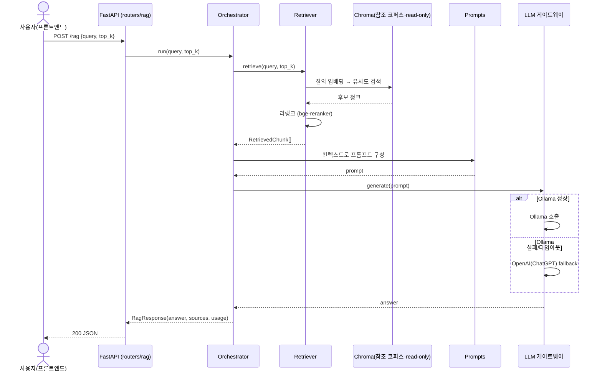
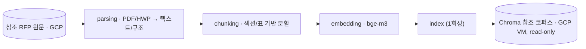
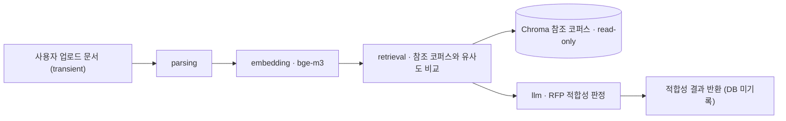

# 서비스 아키텍처 (완성 목표 기준)

정부 제안요청서(RFP) 분석 RAG 서비스의 **완성 시 목표 구성**입니다.
`예정` 표시는 아직 미구현(설계상 추가 예정)이고, 나머지는 현재 코드 기준입니다.

핵심 원칙:
- **의존 방향은 `api → rag_core` 단방향**이며, `rag_core`는 FastAPI 없이 단독 동작. 도메인 모델·계약(Protocol)의 단일 원천은 `rag_core`.
- **Chroma 벡터DB는 사전 구축된 "참조 코퍼스"**로, GCP VM 경로에 적재되어 **런타임에는 read-only**입니다(운영 중 추가 적재 없음).
- **업로드 기능은 DB 적재가 아니라 "RFP 적합성 검사"용**입니다 — 사용자가 올린 문서를 참조 코퍼스에 비춰 적합성을 판정하고, **업로드 문서는 영속 저장하지 않습니다(transient)**.

---

## 1) 서비스 전체 구성 (컴포넌트 / 레이어)

### 구성부 세부 설명

- **프론트엔드 (웹 UI, `frontend/`)** — Streamlit 앱. 질의 입력·답변/근거 표시(`views/rag_query.py`), 적합성 검사용 문서 업로드(`views/upload_check.py`). FastAPI에 **HTTP로만** 요청하며 `rag_core`/`api`를 import하지 않음(백엔드 목업↔실제 전환에 무관). VM 배포는 FE 8501만 외부 개방, API는 loopback 8090 — `deploy/systemd/rfp-*.service`·`frontend/README.md` 참고.
- **API 레이어 (`src/api`)** — 웹 서버 관심사만 담당(thin):
  - `main.py` — FastAPI 엔트리포인트, `lifespan`·라우터 등록.
  - `routers/upload.py` — 사용자가 올린 문서의 **RFP 적합성 검사**(참조 코퍼스와 비교). `POST /upload`: 형식(hwp/pdf)·크기 검증 → 임시 파일 저장 → `SuitabilityChecker.check()` → **응답 후 임시 파일 폐기**. 업로드 문서는 **DB에 적재하지 않고 transient**. 실제 판정 로직은 예정이라 현재 `use_mock=True`에서 `MockSuitabilityChecker` 사용.
  - `routers/rag.py` — `POST /rag`. 요청 검증 → `Orchestrator.run()` 호출 → 응답 변환(비즈니스 로직 없음).
  - `schemas.py` — HTTP 전용 DTO. `RagRequest`(입력) 정의, `RagResponse`는 `rag_core`에서 re-export.
  - `dependencies.py` — `app.state`의 구현체를 `Depends`로 라우터에 주입(타입은 `rag_core`의 Protocol).
  - `lifespan.py` + `config.py` — 시작 시 `Settings`(`use_mock` 등) 읽어 구현을 조립해 `app.state`에 등록.
  - `mock.py` — `MockRetriever`/`MockLLM`/`MockOrchestrator`(로컬·테스트용, `use_mock=True`).
- **도메인 코어 (`src/rag_core`)** — RFP 처리 로직, FastAPI 비의존:
  - `pipeline.py · Orchestrator` `예정` — 단계들을 **조합만** 함. `run(query, top_k) -> RagResponse`.
  - `schemas.py` / `interfaces.py` — `Document`·`Chunk`·`RetrievedChunk`·`RagResponse`·`SuitabilityResult` 및 `Parser`·`Chunker`·`Embedder`·`Retriever`·`LLMClient`·`Orchestrator`·`SuitabilityChecker`(Protocol). **단일 원천**.
  - `parsing` — PDF/HWP → 텍스트/구조 추출(코퍼스 구축·업로드 검사 양쪽에서 사용). 진입점 `RfpParser`(Parser 계약, `parse(file_path)->Document`), 추출 로직은 `pipeline.py`.
  - `chunking` — 섹션/표 기반 분할(사업명·발주기관 등 메타 prefix 부여).
  - `embedding` — `bge-m3`로 텍스트 벡터화.
  - `retrieval` — Chroma 참조 코퍼스에서 유사도 검색 후 `bge-reranker`로 리랭크(**read-only**).
  - `prompts` `예정` — 검색 컨텍스트로 LLM 프롬프트 구성(템플릿은 파일로 분리).
  - `llm` `예정` — LLM 호출. **Ollama 1차, 실패 시 OpenAI(ChatGPT) fallback**.
- **외부 리소스**:
  - **Chroma (참조 코퍼스)** — 사전 구축되어 GCP VM 경로에 적재. **런타임 read-only**(운영 중 추가 적재 없음).
  - **bge-m3 / bge-reranker** — 임베딩·리랭크 모델.
  - **LLM 게이트웨이** — Ollama(`127.0.0.1:11434`) 우선, 장애·타임아웃 시 OpenAI로 전환.
- **평가(`eval`, 오프라인)** — 골든 데이터셋과 `metrics.py`(순수 함수)로 파이프라인 품질 측정. 런타임 경로와 분리.

---

## 2) 질의 처리 흐름 (runtime · `POST /rag`)

### 단계 세부 설명

1. **요청 수신** — 프론트엔드가 `POST /rag`로 `query`, `top_k`(1~50) 전송. `RagRequest`로 검증(422 시 거부).
2. **오케스트레이션 진입** — 라우터가 주입받은 `Orchestrator.run(query, top_k)` 호출(라우터엔 로직 없음).
3. **검색(retrieve)** — 질의를 `bge-m3`로 임베딩 → Chroma 참조 코퍼스에서 유사도 검색(read-only)으로 후보 청크 확보.
4. **리랭크** — `bge-reranker`로 후보를 재정렬해 상위 `top_k`만 선별 → `RetrievedChunk[]`.
5. **프롬프트 구성** — 선별 청크를 컨텍스트로 묶어 프롬프트 생성(템플릿 기반).
6. **LLM 생성** — `Ollama` 1차 호출, 장애·타임아웃 시 `OpenAI(ChatGPT)`로 fallback.
7. **응답 변환** — `RagResponse(answer, sources, usage)`로 직렬화해 200 JSON 반환(근거 청크 포함).

---

## 3) 참조 코퍼스 구축 (1회성·오프라인 — 완료)

> 운영 중 실행되는 기능이 **아닙니다.** 참조 RFP 원문을 한 번 처리해 Chroma에 적재한 빌드 과정이며, 결과물(벡터 코퍼스)은 이미 GCP VM에 read-only로 존재합니다. 코퍼스 갱신이 필요할 때만 오프라인으로 재실행합니다.

### 단계 세부 설명

1. **참조 원문** — 검증된 정부 RFP 원문(PDF/HWP) 집합. GCP에 보관(git 커밋 금지).
2. **파싱(parsing)** — 텍스트·구조(섹션/표/메타) 추출 → `Document`.
3. **청킹(chunking)** — 섹션/표 단위 분할 + 사업명·발주기관·공고번호 등 메타 부여 → `Chunk[]`.
4. **임베딩(embedding)** — `bge-m3`로 각 청크 벡터화.
5. **인덱싱(index, 1회성)** — 벡터/메타를 Chroma에 적재 → 이후 런타임 검색의 read-only 대상.

---

## 4) 업로드 RFP 적합성 검사 흐름 (라우터 구현 · 실판정 예정)

> 업로드 문서는 **참조 코퍼스에 적재하지 않습니다.** 참조 코퍼스를 기준으로 "이 문서가 RFP로서 적합한지"를 판정한 뒤 결과만 반환하고, 업로드 데이터는 폐기(transient)합니다.

### 단계 세부 설명

1. **업로드(transient)** — 사용자가 임의 문서 업로드(`POST /upload`). 형식(hwp/pdf)·크기 검증 후 임시 파일로만 받고, 응답 시점에 폐기(영속 저장 없음).
2. **파싱·임베딩** — 업로드 문서를 `RfpParser`로 파싱 후 `bge-m3`로 임베딩.
3. **참조 비교(retrieval)** — 참조 코퍼스에서 유사 RFP 청크를 검색(read-only)해 비교 근거 확보.
4. **적합성 판정(llm)** — 참조 근거를 바탕으로 LLM이 "RFP 적합성"을 판정(누락 항목·형식 등 피드백 포함 가능).
5. **결과 반환** — `SuitabilityResult`(is_suitable·score·reasons·sources)만 응답. **업로드 문서·중간 산출물은 DB에 남기지 않음.**

> 구현 현황: 라우터·`SuitabilityChecker` 계약·`SuitabilityResult`·`MockSuitabilityChecker`는 구현됨. 2~4단계를 조합하는 **실제 `SuitabilityChecker` 구현은 예정**(llm/prompts 단계 완성 후 `use_mock=False` 경로에서 배선).

---

> 참고: `예정` 항목과 LLM fallback 정책은 완성 목표 기준이며, 구현이 진행되면 본 문서를 갱신하세요.
